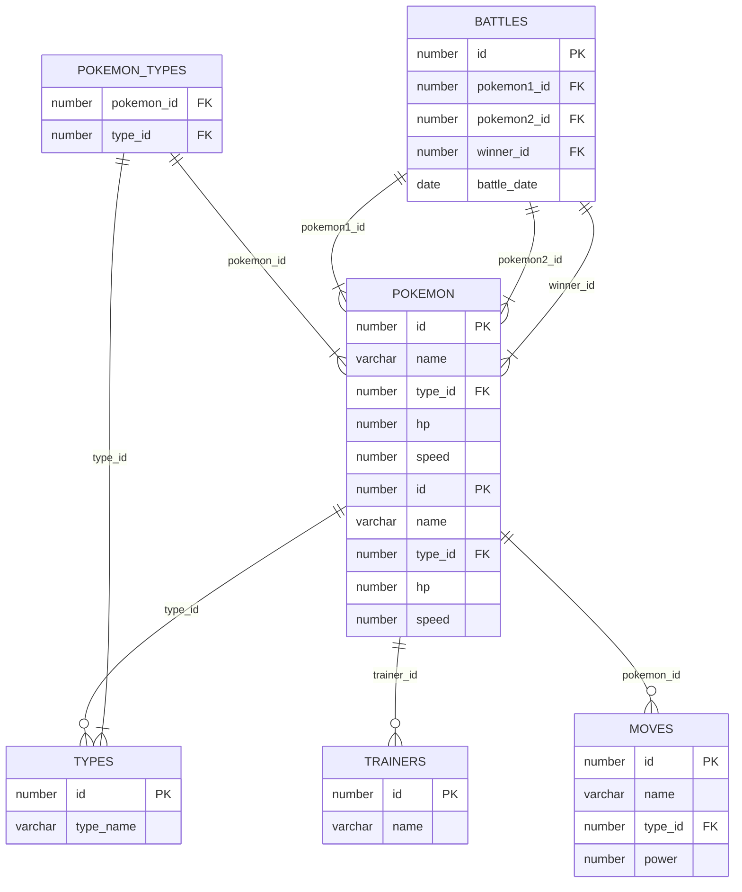

### Enunciado de la Prueba de Pokémon

---

**Contexto:**

Eres un desarrollador de bases de datos trabajando para la Liga Pokémon Internacional. Tu tarea es diseñar y manipular una base de datos que contiene información sobre Pokémon, sus entrenadores, movimientos y batallas. La Liga Pokémon quiere asegurarse de que su sistema de gestión de datos es eficiente y está correctamente diseñado para manejar consultas y operaciones comunes que se realizan diariamente.

### Estructura de la Base de Datos

La base de datos está compuesta por las siguientes tablas:

- **types**: Contiene los diferentes tipos de Pokémon.
  - `id` (PRIMARY KEY)
  - `type_name` (VARCHAR2, UNIQUE)

- **pokemon**: Contiene información básica de cada Pokémon.
  - `id` (PRIMARY KEY)
  - `name` (VARCHAR2)
  - `type_id` (FOREIGN KEY a `types.id`)
  - `hp` (NUMBER)
  - `speed` (NUMBER)

- **trainers**: Contiene información sobre los entrenadores Pokémon.
  - `id` (PRIMARY KEY)
  - `name` (VARCHAR2)
  - `age` (NUMBER)
  - `city` (VARCHAR2)

- **pokemon_trainers**: Tabla de unión que asocia Pokémon con Entrenadores.
  - `trainer_id` (FOREIGN KEY a `trainers.id`)
  - `pokemon_id` (FOREIGN KEY a `pokemon.id`)
  - PRIMARY KEY (`trainer_id`, `pokemon_id`)

- **moves**: Contiene los movimientos de los Pokémon.
  - `id` (PRIMARY KEY)
  - `name` (VARCHAR2)
  - `type_id` (FOREIGN KEY a `types.id`)
  - `power` (NUMBER)

- **battles**: Contiene información sobre batallas Pokémon.
  - `id` (PRIMARY KEY)
  - `pokemon1_id` (FOREIGN KEY a `pokemon.id`)
  - `pokemon2_id` (FOREIGN KEY a `pokemon.id`)
  - `winner_id` (FOREIGN KEY a `pokemon.id`)
  - `battle_date` (DATE)

La base de datos está pre-poblada con los siguientes datos:

- Al menos 150 Pokémon distribuidos entre varios tipos.
- Una variedad de entrenadores Pokémon.
- Varios movimientos de diferentes tipos.
- Historial de batallas Pokémon.

### Objetivos de la Prueba

Como desarrollador, se te solicita realizar las siguientes tareas usando PL/SQL:

1. **Cursores:**
   - Crea un cursor para seleccionar todos los Pokémon de tipo 'Electric' y muestra sus nombres.

2. **Iteraciones (LOOP, FOR o WHILE):**
   - Escribe un bloque PL/SQL que utilice un `FOR LOOP` para actualizar el campo `power` de todos los movimientos del tipo 'Fire', incrementándolo en 10.

3. **Condiciones (IF/ELSE):**
   - Escribe un bloque PL/SQL que actualice el campo `hp` de un Pokémon específico. Si el `hp` es menor a 50, incrementa su `hp` en 20. Si el `hp` es 50 o mayor, incrementa su `hp` en 10.

4. **Switch/Case:**
   - Escribe un bloque PL/SQL que actualice el campo `speed` de un Pokémon basado en su tipo. Si el tipo es 'Electric', incrementa su `speed` en 15. Si el tipo es 'Water', incrementa su `speed` en 10. Para cualquier otro tipo, incrementa su `speed` en 5.

5. **Records:**
   - Escribe un bloque PL/SQL que defina un record para almacenar la información de un Pokémon (nombre, tipo y hp). Usa este record para seleccionar un Pokémon específico y mostrar su información.

6. **Uso de Cursores y JOIN entre múltiples tablas:**
   - Crea un cursor que seleccione los nombres de los entrenadores y los nombres de sus Pokémon. Usa este cursor para mostrar el nombre del entrenador y el nombre de su Pokémon.

7. **Inserción en una tabla de resultados:**
   - Escribe un bloque PL/SQL que inserte los resultados de una batalla Pokémon en la tabla `battles`. La batalla es entre dos Pokémon específicos, y debes determinar al ganador basado en sus puntos de salud (`hp`). Inserta los IDs de los Pokémon, el ID del ganador y la fecha de la batalla.

8. **Uso de FOR LOOP y JOIN:**
   - Escribe un bloque PL/SQL que utilice un `FOR LOOP` para mostrar todos los entrenadores que tienen al menos un Pokémon de tipo 'Water'. Muestra el nombre del entrenador y el nombre de su Pokémon.

9. **Uso de SWITCH/CASE con múltiples tablas:**
   - Escribe un bloque PL/SQL que determine y muestre el tipo del Pokémon ganador de una batalla específica. Usa un `CASE` para mostrar mensajes diferentes según el tipo del Pokémon ganador.

### Entregables

Debes entregar:

- Los scripts PL/SQL con las soluciones a cada una de las tareas.
- Un archivo de texto con la salida generada por los bloques PL/SQL que muestran resultados.

Asegúrate de que tu código esté bien documentado y explicado para facilitar la revisión. ¡Buena suerte, entrenador!

